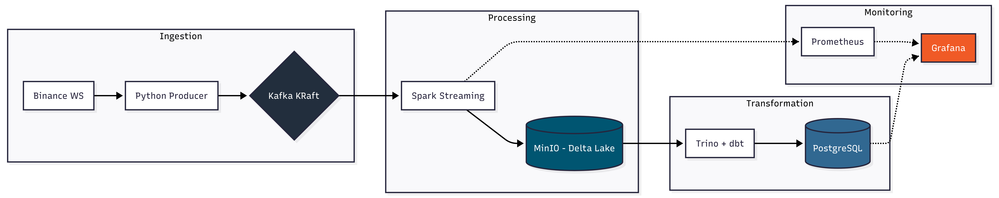
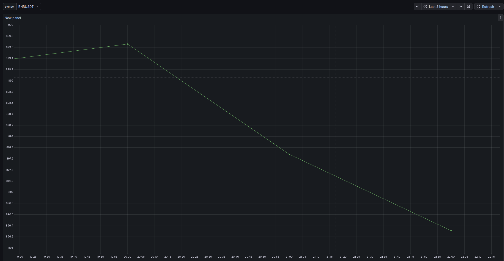
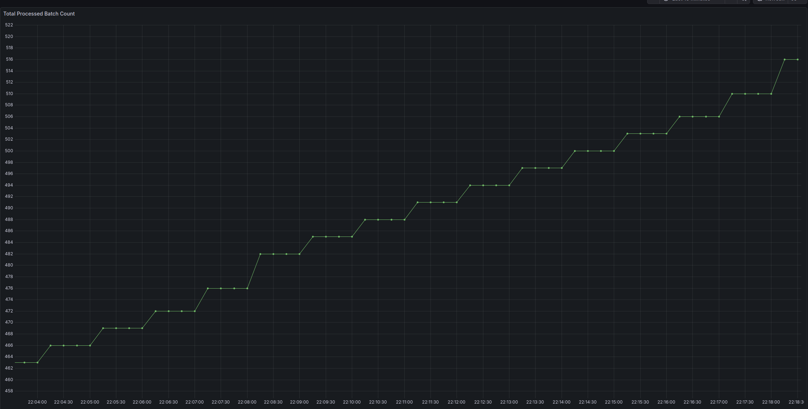

## Binance Real-Time Data Pipeline (End-to-End)

An end-to-end data engineering pipeline that ingests live cryptocurrency trade data from Binance, processes it using
Spark Structured Streaming, and implements a Medallion Architecture (Bronze, Silver, Gold) with dbt and Trino.

## Motivation & Project Goal

The primary goal of this project is to implement a modern, scalable data stack using industry-standard tools. This
project serves as a comprehensive hands-on exploration of:

Real-time Stream Processing: Managing high-velocity data using Kafka and Spark.

Modern Data Stack (MDS): Bridging the gap between raw streaming data and analytical insights using dbt and Trino.

Infrastructure Observability: Monitoring system performance with Prometheus and Grafana.

Containerized Orchestration: Managing a complex multi-service environment via Docker.

## 🏗 Architecture



## Features

- **Real-time Ingestion**: Live BTC/USDT trade data via Binance WebSocket API.
- **Data Lake Storage**: Processed data is stored in Amazon S3 in partitioned Parquet format.
- **Message Broker**: Apache Kafka (KRaft mode) for high-throughput data decoupling.
- **Stream Processing**: Apache Spark 3.5.1 Structured Streaming for real-time data processing (Cluster usage in
  development).
- **Dependency Management**: Local Ivy cache for Spark packages to ensure fast restarts and offline capability.
- **Monitoring**: Infrastructure monitoring using Prometheus to scrape Spark metrics and Grafana for visualization.
- **Dockerized**: Fully containerized environment for consistent deployment.

## 🛠️ Tech Stack

- Streaming: Spark Structured Streaming (3.5.1), Kafka (KRaft mode).

- Storage: MinIO (S3 Compatible), Delta Lake format.

- Transformation & Modeling: dbt (Data Build Tool), Trino SQL Engine.

- Serving Layer: PostgreSQL (Serving database for Grafana).

- Monitoring: Prometheus & Grafana.

- Orchestration: Docker & Docker Compose.

## Getting Started

### 1. Environment Setup

```
1.  Create a file in the root directory: .env
    GF_SECURITY_ADMIN_PASSWORD=admin

    MINIO_USERNAME=admin
    MINIO_PASSWORD=password
    
    POSTGRES_USER=postgres
    POSTGRES_PASSWORD=postgres
    
    DBT_TRINO_USER=admin
    DBT_TRINO_PASSWORD=password
    DBT_TRINO_HOST=trino
    
```

```
2. Update the S3 bucket paths in the spark/spark_stream.py

```

```

3. Run the Pipeline
   Start all services in detached mode:
   $ docker-compose up -d

```

```

4. Run the dbt project to fill the postgres database with data
   Start all services in detached mode:
   
   $ docker exec -it dbt dbt run 

```

```
5. Verify the Flow
    
   Producer Logs: $ docker logs -f binance-producer

   Spark Processing: $ docker logs -f spark
    
   Grafana Dashboard: Open http://localhost:3000 login with admin/your_password (Binance Coin Hourly Price Dashboard is broken at this state)
    
   Spark UI: Open http://localhost:4040
   
   Minio UI: Open http://localhost:9000 
   

```

## Project Structure

- producer/: Python script to fetch data from Binance and push to Kafka.
- spark/: Spark Streaming application logic.
- ivy/: Local cache directory for Spark/Hadoop/Kafka JAR files.
- monitoring/: Configuration and provisioning for Grafana.
- prometheus.yml: Configuration for Prometheus metrics scraping.
- trino/: Catalog configurations for S3 and Delta Lake integration.

## Monitoring & Verification

Grafana: http://localhost:3000 (Includes pre-configured "Binance Coin Hourly Price" dashboard).

Hourly Avg Prices Dashboard:

Processed Batch Count Dashboard:

Spark UI: http://localhost:4040.

## Configuration Details

- Spark Ivy Cache: The project mounts ./ivy to /home/spark/.ivy2 inside the container to avoid re-downloading large JAR
  files (like Kafka SQL and AWS SDK) on every run.
- Networking: All services communicate via a dedicated internal bridge network: pipeline-net.

⚠️ Implementation & Security Note

- Note on Hard-coded Credentials: Several configurations (e.g., Postgres passwords, Kafka brokers) contain hard-coded
values.

- This is an intentional choice to speed up implementation and simplify the setup for this test project.
For production environments, these should be managed via secure secrets management tools like AWS Secrets Manager etc.

- To update grafana binance avg price dashboard, run docker exec -it dbt dbt run 